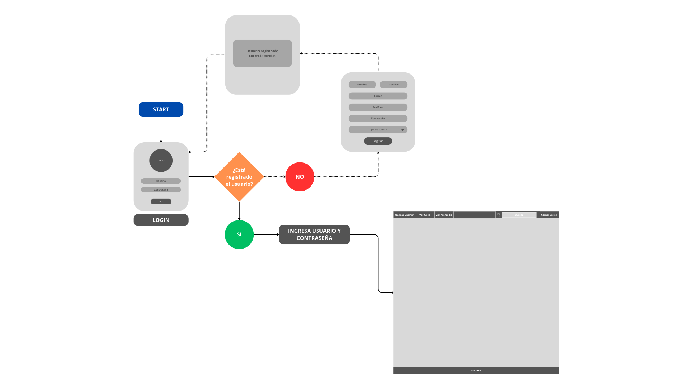

# Diagramas de Flujo (UserFlows, TaskFlows, WireFlows)

# Índice
- [UserFlows](#userflows)
- [TaskFlows](#taskflows)
  - [TaskFlows-Alumno](#taskflows-alumno)
  - [TaskFlows-Profesor](#taskflows-profesor)
- [WireFlows](#wireflows)
  - [WireFlow-Home-Alumno](#wireflow-home-alumno)
  - [WireFlow-Home-Profesor](#wireflow-home-profesor)

## UserFlows

## TaskFlows

### TaskFlows-Alumno

### TaskFlows-Profesor

## WireFlows

### WireFlow-Home-Alumno

### WireFlow-Home-Profesor

